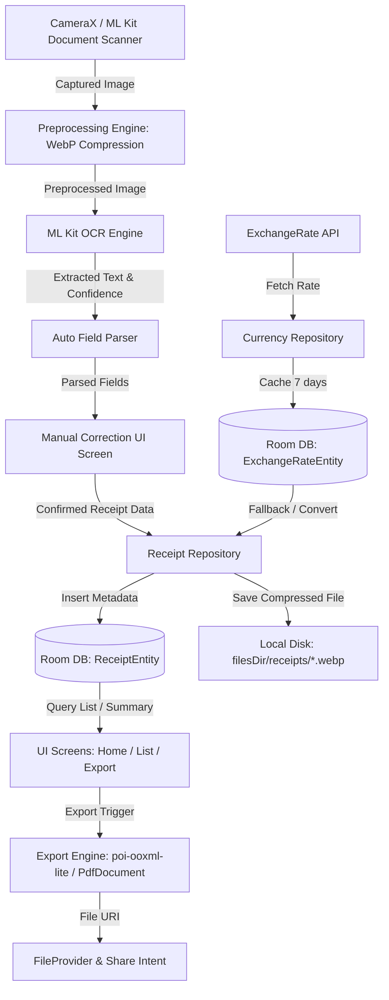

# Receipt Manager App (영수증 관리 앱) Design Document

- **Date**: 2026-07-31
- **Target Platform**: Android (minSdk 31, targetSdk 35, compileSdk 35)
- **Architecture**: MVVM + Clean Architecture with Hilt DI, Jetpack Compose (Material3), StateFlow, Room DB

---

## 1. Executive Summary & Architecture Refinements

본 앱은 서류/영수증의 카메라 촬영, 자동 크롭/전처리, ML Kit 기반 텍스트 추출(OCR), 다중 통화 환율 자동 조회 및 원화 환산, 엑셀/PDF 지출결의서 내보내기 및 룸 DB 영속화를 수행하는 오프라인 중심 영수증 관리 앱입니다.

### 핵심 아키텍처 최적화 결정 (Critical Architectural Decisions)
1. **OpenCV 의존성 전면 제거 (APK ~50MB 경량화)**: ML Kit Document Scanner API가 자체 문서 경계 감지, 자동 크롭 및 원근 보정을 완벽히 제공하므로 OpenCV 네이티브 라이브러리를 제거하여 APK 크기를 최소화합니다.
2. **Apache POI 경량화 (`poi-ooxml-lite:5.4.1`)**: 65K 메서드 카운트를 초과하는 `poi-ooxml` 대신 `poi-ooxml-lite` 또는 `FastExcel`을 적용하여 엑셀 12컬럼 출력을 경량화합니다.
3. **`kotlinx.serialization` 적용**: Gson의 리플렉션 대신 코틀린 네이티브 컴파일 타임 안전성을 갖춘 `kotlinx.serialization` + Retrofit Converter를 적용합니다.
4. **ExchangeRate API & 7일 오프라인 캐시**: Open Access 무료 환율 API (`ExchangeRate-API.com` / `exchangerate.host` BuildConfig API Key) 연동 + Room DB 7일 캐싱 + 수동 환율 입력 폴백.
5. **OCR 신뢰도 점수 (`ocrConfidence: Int? = null`)**: 기본값을 100에서 `null` / `-1`로 변경하여 판독 전 신뢰도 오해를 방지하고, ML Kit OCR 실행 결과의 `elements.minOfOrNull { it.confidence } * 100` 계산으로 정확히 매핑합니다.

---

## 2. Tech Stack & Dependencies

| Category | Technology / Library | Purpose |
|---|---|---|
| **UI Framework** | Jetpack Compose + Material3 | 모던 앤 프리미엄 UI, 반응형 레이아웃 |
| **Architecture / DI** | MVVM + Clean Architecture, Hilt (`hilt-navigation-compose`) | 단방향 데이터 흐름 및 의존성 주입 |
| **Database** | Room DB (`androidx.room:room-ktx`, `ksp`) | 메타데이터 12컬럼, 통화/환율 오프라인 캐시 |
| **Camera & Scanner** | CameraX + ML Kit Document Scanner API | 문서 영역 자동 감지, 크롭, 원근 보정 및 이미지 전처리 (GMS Check) |
| **OCR Text Extraction** | ML Kit Text Recognition (Korean, English, Japanese, Numbers) | 상호/금액/일시/사업자번호/부가세 필드 자동 추출 |
| **Network & Serialization** | Retrofit2 + OkHttp3 + `kotlinx.serialization` | ExchangeRate API 조회 및 안전한 JSON 파싱 |
| **Image Storage** | Android File System + WebP Compression | `filesDir/receipts/*.webp` 압축 파일 보관 |
| **Export Engines** | `org.apache.poi:poi-ooxml-lite:5.4.1` / Android Native `PdfDocument` | 12컬럼 고정 스키마 `.xlsx` 엑셀 & PDF 지출결의서 생성 |
| **Sharing** | `FileProvider` + Android System Intent | 이메일/메신저 내보내기 공유 |

---

## 3. System Architecture & Data Flow



---

## 4. Room Database Schema

### 4.1 `ReceiptEntity` (TableName: `receipts`)

```kotlin
@Entity(tableName = "receipts")
data class ReceiptEntity(
    @PrimaryKey(autoGenerate = true) val id: Long = 0,
    val merchantName: String,             // 상호명 (예: (주) 스타벅스 코리아)
    val date: String,                     // 거래 일자 (YYYY.MM.DD)
    val totalAmount: Double,              // 결제 금액
    val currency: String = "KRW",         // 통화 코드 (KRW, USD, JPY, EUR ...)
    val exchangeRate: Double = 1.0,       // 원화 환율
    val convertedAmountKrw: Double = totalAmount, // 원화 환산 금액
    val businessNumber: String? = null,   // 사업자등록번호 (123-45-67890)
    val vatAmount: Double? = null,        // 부가세
    val category: String = "식비",        // 계정과목/카테고리
    val tags: String = "",                // 태그 목록 (쉼표 구분 문자열 예: "카페,업무,회의")
    val paymentMethod: String = "카드",    // 결제 수단 (법인카드, 개인카드, 현금, 해외 등)
    val proofType: String = "일반영수증",  // 적격증빙 라벨 (일반영수증, 세금계산서, 카드매출전표, 현금영수증)
    val memo: String? = null,             // 텍스트 메모
    val imagePath: String = "",           // 디스크 이미지 파일 경로
    val ocrConfidence: Int? = null,       // OCR 신뢰도 점수 (null: 미측정, 0~100)
    val isPersonalOrCancelled: Boolean = false, // 개인사용분 / 취소분 여부
    val isDeleted: Boolean = false,       // 소프트 삭제 여부 (휴지통)
    val deletedAt: Long? = null,          // 복구를 위한 삭제 일시
    val createdAt: Long = System.currentTimeMillis()
)
```

---

## 5. UI Architecture & Screen Structure

### 5.1 Main Layout (4 Top-Level Tabs via Bottom NavigationBar)
1. **Home Screen (`/home`)**:
   - 당월 총 지출액 및 원화 환산 금액 요약 카드
   - 최근 등록 카드 캐러셀 & 최근 영수증 내역
   - 플로팅 카메라 버튼 (FAB)
2. **Receipt List & Search Screen (`/list`)**:
   - 월별 그룹화 리스트 Header (예: 2023년 10월, 9월)
   - 키워드 검색바 (상호명, 메모, 용도)
   - Filter Chips: 결제수단(법인/개인카드), 증빙유형(수금완료/지출증빙), 카테고리
3. **Export & Report Screen (`/export`)**:
   - 엑셀 (`poi-ooxml-lite` 12컬럼 스키마) 내보내기
   - PDF 지출결의서 미리보기 및 이메일/메신저 공유
4. **Settings Screen (`/settings`)**:
   - 환율 자동 업데이트 토글 & 수동 환율 설정
   - 수동 JSON 백업 (.json) 및 데이터 복원 (.json)
   - WebP 이미지 최적화 압축 설정

---

## 6. Document Export Schema (12-Column XLSX Format)

| Column Index | Field Name | Description |
|---|---|---|
| 1 | 일자 | YYYY.MM.DD |
| 2 | 상호명 | 영수증 상호 |
| 3 | 사업자등록번호 | 000-00-00000 |
| 4 | 결제금액 | 원화 금액 또는 거래 통화 금액 |
| 5 | 통화 (Currency) | KRW, USD, JPY 등 |
| 6 | 적용 환율 | 1.0 (KRW) 또는 적용 환율 수치 |
| 7 | 원화 환산 금액 | 원화 기준 최종 금액 |
| 8 | 부가세 | 부가가치세 |
| 9 | 계정과목 (카테고리) | 카페, 교통비, 외식비, 회식비 등 |
| 10 | 결제수단 | 법인카드, 개인카드, 현금 등 |
| 11 | 적격증빙 라벨 | 카드매출전표, 세금계산서 등 |
| 12 | 메모 / 태그 | 비고 및 태그 |
